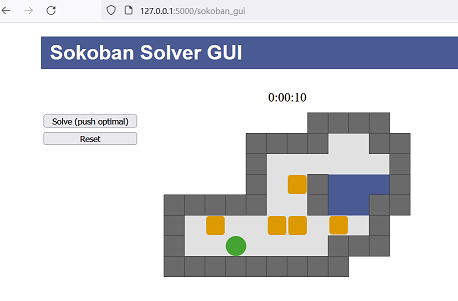

# Sokoban solver - warehouse work with Prolog

This project is a by-product of learning Prolog.

Tested with SWI-Prolog 8.4.2.

## Usage

In command line, run one of the following:

* For A* search based solver:
```
$ swipl sokoban-astar.pl
```

* For A* search based reverse solver:
```
$ swipl sokoban-astar-reverse.pl
```

* For tabled solver:
```
$ swipl sokoban-tabled.pl
```

Then run the query, such as
```
?- solution('levels/example-01.lvl', Plan, N). 
```
Or use the simple http GUI:
```
$ swipl server.pl
```
```
?- start_svr(5000, 'levels/example-03.lvl'). 
```
Then connect with a browser - http://localhost:5000/sokoban_gui


Stop the server with
```
?- stop_svr(5000). 
```
## Levels

Board symbols:
```
# - wall
@ - sokoban
$ - box
. - storage
+ - storage + sokoban
* - storage + box
```

You can find more levels in this format [here](http://sneezingtiger.com/sokoban/levels.html).